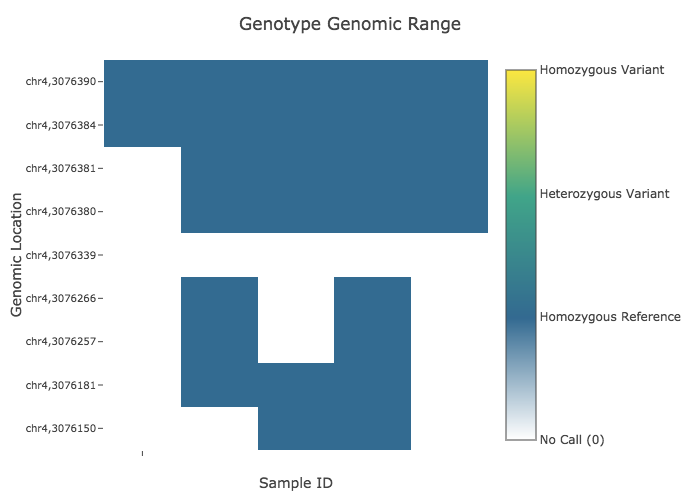
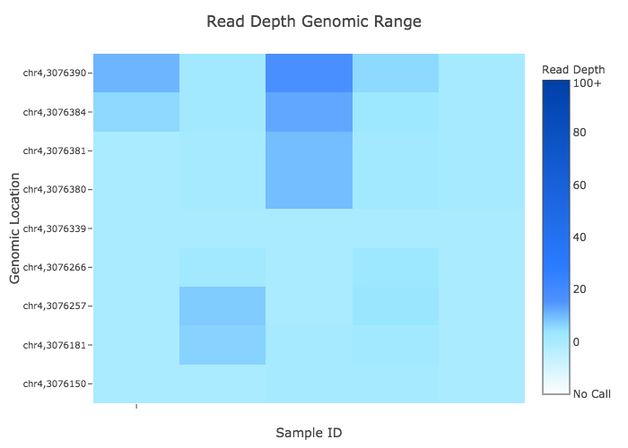

# Examples

To run examples:

1. Install Julia and the VariantVisualization.jl package
2. Download the five test files found [here](https://github.com/compbiocore/VariantVisualization.jl/tree/master/test/test_files) and put them into a working directory with the viva script. 
3. Open the command line (Terminal or Powershell), copy the provided commands into the command line prompt, and press enter. 
4. Your first viva run will take longer than usual (several minutes) because of the way Julia compiles packages. All subsequent runs will be much faster. Each example should take 30-50 seconds to run and you should see the same outputs as those below each demo. 

We encourage you to also run these examples without the flag `-s png` to save and view interactive HTML graphics with cursor hovertext, zooming, panning, and screen capture features. View HTML graphics in your browser by opening the HTML file.

## Default Options

Running viva with no options produces heatmaps of genotype and read depth values for all samples and variant positions in the VCF file with default options. You can read about viva's default settings [here](https://compbiocore.github.io/VariantVisualization.jl/stable/#default-options)

```
julia viva -f test_4X_191.vcf -t Default_Options -s png
```


## Grouping Samples by Metadata Traits and Generating all Four Plots

Group samples by sequencing facility and generate heatmaps of genotype and read depth values as well as scatter plots of average read depth for both all selected samples and all selected variant positions. 

You can find grouping options [here](https://compbiocore.github.io/VariantVisualization.jl/stable/filtering_vcf/#selecting-and-grouping-samples).

```
julia viva -f test_4X_191.vcf -t Grouped_by_Sequencing_Site -g sample_metadata_matrix.csv seq_site_1,seq_site_2 --avg_dp variant,sample -s png
```


 
##Genomic Range and Samples Selection - Genotype and Read Depth Heatmaps with Variant Position Labels

Generate heatmaps of genotype and read depth values of variants selected within a genomic range, in this case, chromosome 4, nucleotides 200000-500000, with y-axis variant position labels.

```
julia viva -f test_4X_191.vcf -t Genomic_Range -r chr4:3076150-3076390 -y positions --select_samples select_samples_list.txt -s png
```



