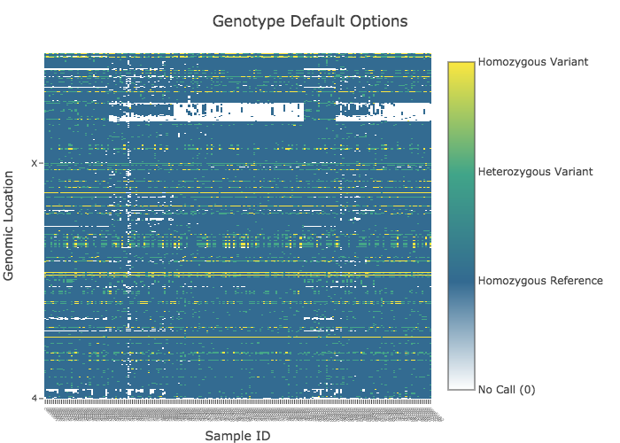
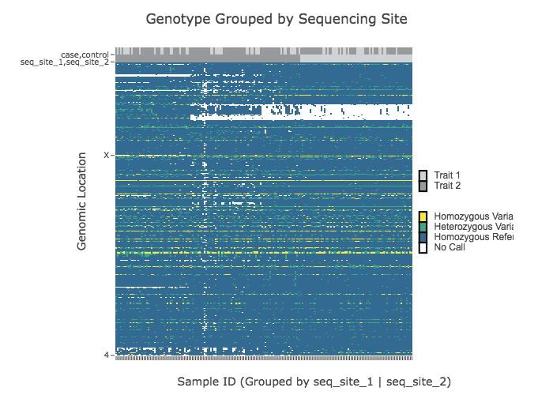
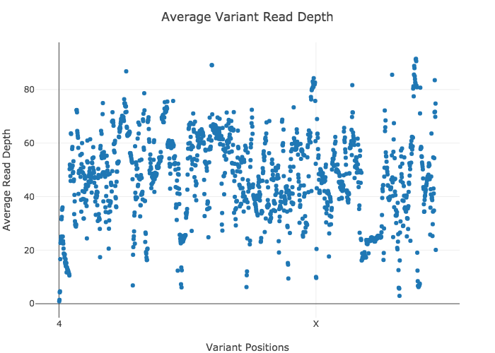

# Examples

To run examples:

One you've installed Julia, VariantVisualization.jl package, and the VIVA script, you can run these examples.

To run the examples:

1. Download the four test files and save them in a working directory with the viva script by copying and pasting the following block of code into the command line.

>cd new\_folder/ 

>curl -L https://raw.githubusercontent.com/compbiocore/VariantVisualization.jl/master/test/test\_files/positions\_list.csv > positions\_list.csv

>curl -L https://raw.githubusercontent.com/compbiocore/VariantVisualization.jl/master/test/test\_files/sample\_metadata\_matrix.csv > sample\_metadata\_matrix.csv

>curl -L https://raw.githubusercontent.com/compbiocore/VariantVisualization.jl/master/test/test\_files/select\_samples\_list.txt > select\_samples\_list.txt

>curl -L https://raw.githubusercontent.com/compbiocore/VariantVisualization.jl/master/test/test\_files/test\_4X\_191.vcf > test\_4X\_191.vcf

2. Copy the example commands found below from the working directory containing the VIVA script, VCF file, and four test files.

3. Your first viva run may take a little longer than usual (several minutes) because of the way Julia compiles packages. All subsequent runs will be much faster. Each example should take 30-50 seconds to run and you should see the same outputs as those below each demo.

*Note:* We encourage you to also run these examples without the flag `-s png` to save and view interactive HTML graphics with cursor hovertext, zooming, panning, and screen capture features. View HTML graphics in your browser by opening the HTML file.

## Default Options

Running viva with no options produces heatmaps of genotype and read depth values for all samples and variant positions in the VCF file with default options. You can read about viva's default settings [here](https://compbiocore.github.io/VariantVisualization.jl/stable/#default-options)

```
julia viva -f test_4X_191.vcf -t Default_Options -s png
```



## Grouping Samples by Metadata Traits and Generating all Four Plots

Group samples by sequencing facility and generate heatmaps of genotype and read depth values as well as scatter plots of average read depth for both all selected samples and all selected variant positions.

You can find grouping options [here](https://compbiocore.github.io/VariantVisualization.jl/stable/filtering_vcf/#selecting-and-grouping-samples).

```
julia viva -f test_4X_191.vcf -t Grouped_by_Sequencing_Site -g sample_metadata_matrix.csv seq_site_1,seq_site_2 --avg_dp variant,sample -s png
```







